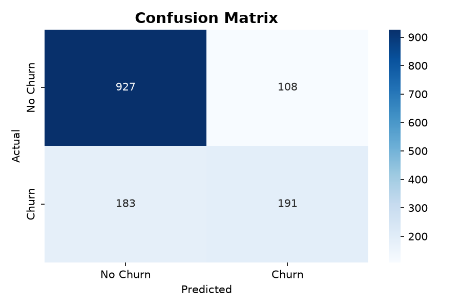
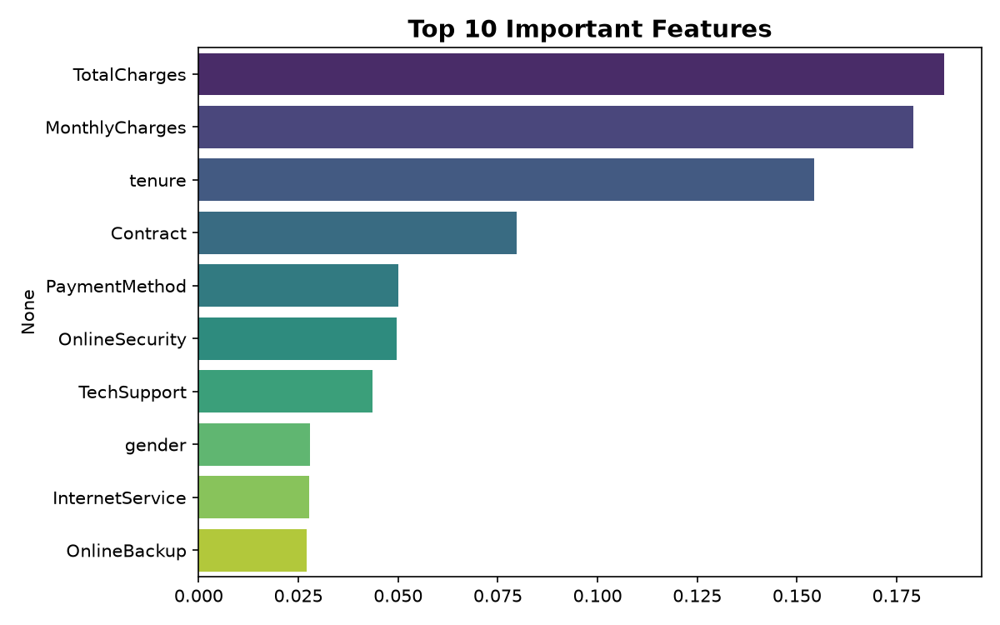
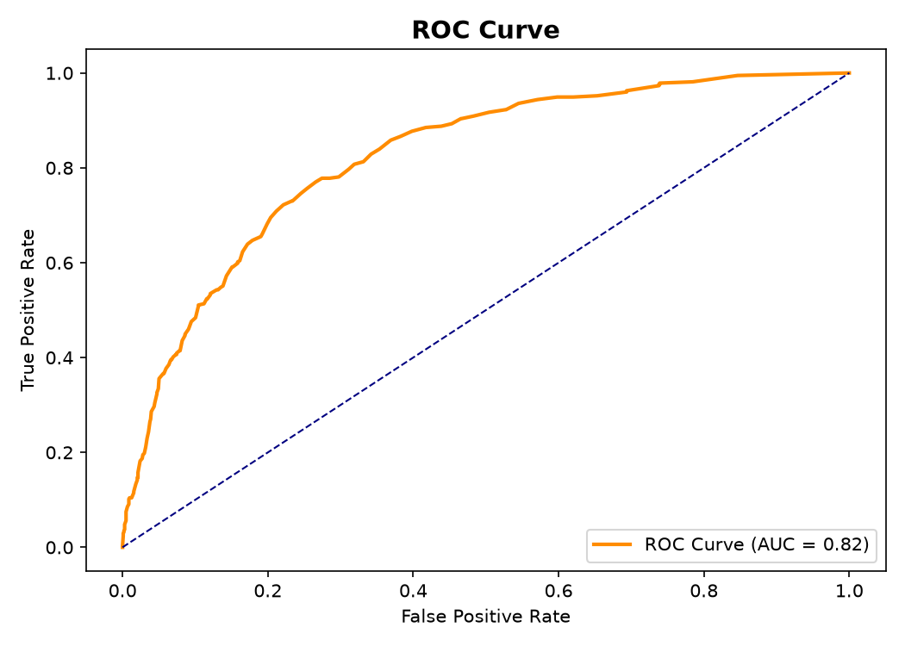

# 📊 Customer Churn Prediction

A Machine Learning project to predict whether a telecom customer 
will churn (leave the service) using Python and Scikit-learn.

---

## 🎯 Problem Statement

Telecom companies lose revenue when customers cancel subscriptions.
This project predicts which customers are likely to leave — before they do!

---

## 🛠️ Tech Stack

| Tool | Purpose |
|------|---------|
| Python 3.11 | Programming Language |
| Pandas & NumPy | Data Manipulation |
| Matplotlib & Seaborn | Visualization |
| Scikit-learn | Machine Learning |
| Streamlit | Web Application |

---

## 📁 Project Structure

customer_churn_prediction/
├── data/
│   └── churn_data.csv
├── src/
│   ├── eda.py
│   ├── data_preprocessing.py
│   └── model_training.py
├── app.py
├── retrain.py
├── requirements.txt
└── README.md

---

## 🤖 Models Compared

| Model | ROC-AUC Score |
|-------|--------------|
| Logistic Regression | ~0.83 |
| Random Forest ✅ Winner | ~0.85 |
| Gradient Boosting | ~0.84 |

---

## 📈 Key Findings

- 🔴 Month-to-month contracts = highest churn risk
- 🔴 New customers (low tenure) leave the most  
- 🔴 High monthly charges increase churn risk
- 🟢 Long-term contracts reduce churn
- 🟢 Tech support availability reduces churn

---

## 🚀 How to Run

### 1. Clone the repo
git clone https://github.com/pipunimethma05-dev/customer-churn-prediction.git
cd customer-churn-prediction

### 2. Install dependencies
pip install -r requirements.txt

### 3. Train the model
python retrain.py

### 4. Run the web app
streamlit run app.py

### 5. Open browser
http://localhost:8501

---

## 📸 Results

### Confusion Matrix

### Feature Importance

### ROC Curve

---

## 👩‍💻 Author

**Pipuni Methma**
🔗 [GitHub](https://github.com/pipunimethma05-dev)

---

⭐ If you found this useful, please give it a star!